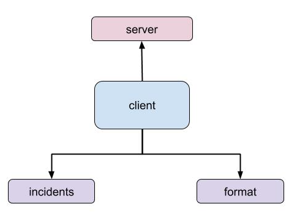
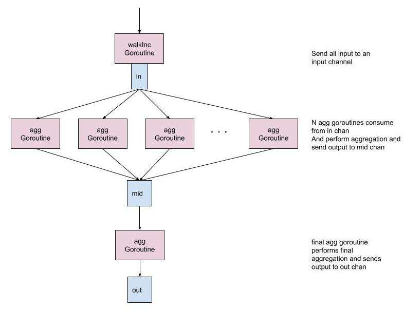

# client
Client contacts the server to fetch incidents details and displays in 
table format. It also processes the incidents in concurrent 
manner and provides aggregated report.

## Setup
```
$ git clone git@github.intuit.com:SHAKIRA/client.git
$ cd client

$ make
>> checking code style
>> building binaries
env CGO_ENABLED=0 GOOS=linux GOARCH= go build -a -installsuffix cgo -o /Users/shakira/go/src/client/bin//client .
>> running all tests
go test -race -v -coverprofile=coverage.txt -covermode=atomic  ./...
?       client  [no test files]
=== RUN   TestExtractContents
--- PASS: TestExtractContents (0.00s)
=== RUN   TestPrintHeader
--- PASS: TestPrintHeader (0.00s)
=== RUN   TestPrintContents
--- PASS: TestPrintContents (0.00s)
PASS
coverage: 84.1% of statements
ok      client/format/table     1.043s  coverage: 84.1% of statements
=== RUN   TestGetResponse
--- PASS: TestGetResponse (0.00s)
=== RUN   TestValidateResponse
--- PASS: TestValidateResponse (0.00s)
=== RUN   TestParseBody
--- PASS: TestParseBody (0.00s)
=== RUN   TestMergeIncs
--- PASS: TestMergeIncs (0.00s)
=== RUN   TestGenerateAggReportPriority
--- PASS: TestGenerateAggReportPriority (0.00s)
=== RUN   TestWalkIncs
--- PASS: TestWalkIncs (0.00s)
PASS
coverage: 94.8% of statements
ok      client/incidents        1.081s  coverage: 94.8% of statements
>> Uploading to codecov
>> skipping due to env


$ make docker
docker build -t "msaas/pasi/client/service/msaas/pasi/client/service/client-linux-amd64:master" \
                --build-arg ARCH="amd64" \
                --build-arg OS="linux" \
                ./
Sending build context to Docker daemon  7.498MB
Step 1/3 : FROM scratch
 ---> 
Step 2/3 : ADD bin/client /
 ---> Using cache
 ---> c69e0925f82c
Step 3/3 : CMD ["/client", "https://host.docker.internal/api/v1/list/incidents"]
 ---> Using cache
 ---> f845bb4f2551
[Warning] One or more build-args [ARCH OS] were not consumed
Successfully built f845bb4f2551
Successfully tagged msaas/pasi/client/service/msaas/pasi/client/service/client-linux-amd64:master

$ make run
>> running docker image
docker run -it msaas/pasi/client/service/msaas/pasi/client/service/client-linux-amd64:master

Number    AssignedTo      Description                    State         Priority   Severity   
#############################################################################################
INC1234   Ric Flair       What’s causin’ all this?       Closed        Critical   Low        
INC1235   Tom Brady       The balls have too much air    In Progress   High       High       
INC1236   Chris Edwards   Login is not working           Open          High       High       
INC1237   John Wu         Windows VM is hung             Blocked       High       High       
INC1238   Pat Gibson      The balls have too less air    In Progress   Low        High       
INC1239   Camela Cabo     The balls are missing          In Progress   Critical   High       

Priority   Sum   
#################
Critical   2     
High       3     
Low        1    
```
## Design
### Code Design

### Concurrency Design


## Various Expected Outputs
- Trap non-200 errors
```
$ go run client.go https://localhost/not_found
FATA[03-09-2019 16:47:52] Received 404 status code                     
exit status 1
```
- Trap different content type
```
$ go run client.go https://localhost/
FATA[03-09-2019 16:55:31] Content type not spplication/json. Received => text/plain; charset=utf-8 
exit status 1
```
- trap content-length mismatch
```
$ go run client.go https://localhost/api/v1/list/incidents
FATA[03-09-2019 17:01:01] content-Length mismatch 905 vs 185           
exit status 1
```
- Trap connection errors
```
$ go run client.go https://localhost/api/v1/list/incidents
WARN[03-09-2019 17:02:56] Attempt 1 Get https://localhost/api/v1/list/incide: dial tcp [::1]:443: connect: connection refused 
WARN[03-09-2019 17:02:56] Attempt 2 Get https://localhost/api/v1/list/incide: dial tcp [::1]:443: connect: connection refused 
WARN[03-09-2019 17:02:56] Attempt 3 Get https://localhost/api/v1/list/incide: dial tcp [::1]:443: connect: connection refused 
WARN[03-09-2019 17:02:56] Attempt 4 Get https://localhost/api/v1/list/incide: dial tcp [::1]:443: connect: connection refused 
WARN[03-09-2019 17:02:56] Attempt 5 Get https://localhost/api/v1/list/incide: dial tcp [::1]:443: connect: connection refused 
FATA[03-09-2019 17:02:56] Get https://localhost/api/v1/list/incide: dial tcp [::1]:443: connect: connection refused 
exit status 1
```
### Benchmarking
```
incidents@shakira$ go test -bench=.
goos: darwin
goarch: amd64
pkg: client/incidents
BenchmarkMergeIncs10-8           100000      22612 ns/op
BenchmarkMergeIncs100-8          100000      23140 ns/op
BenchmarkMergeIncs500-8          100000      22655 ns/op
BenchmarkMergeIncs1000-8         100000      22468 ns/op
BenchmarkMergeIncs100000-8       100000      23803 ns/op
BenchmarkMergeAll/1-8               100   19958537 ns/op
BenchmarkMergeAll/11-8               50   26694835 ns/op
BenchmarkMergeAll/21-8               50   27385795 ns/op
BenchmarkMergeAll/31-8               50   25227422 ns/op
BenchmarkMergeAll/41-8               50   27031961 ns/op
BenchmarkMergeAll/51-8               50   24561098 ns/op
BenchmarkMergeAll/61-8               50   23406828 ns/op
BenchmarkMergeAll/71-8              100   23677387 ns/op
BenchmarkMergeAll/81-8               50   24814355 ns/op
BenchmarkMergeAll/91-8               50   24496930 ns/op
PASS
ok    client/incidents  27.598s

```